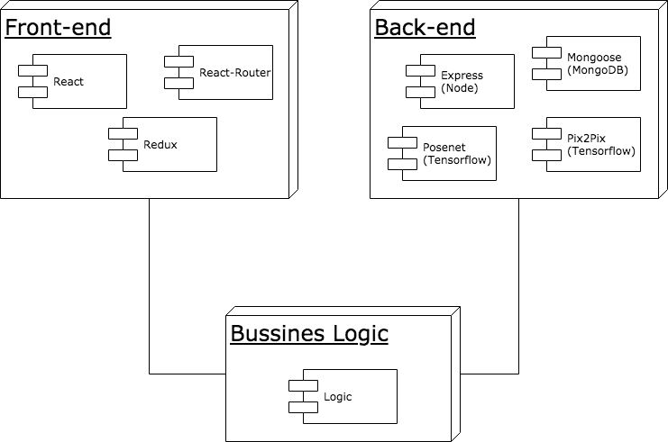
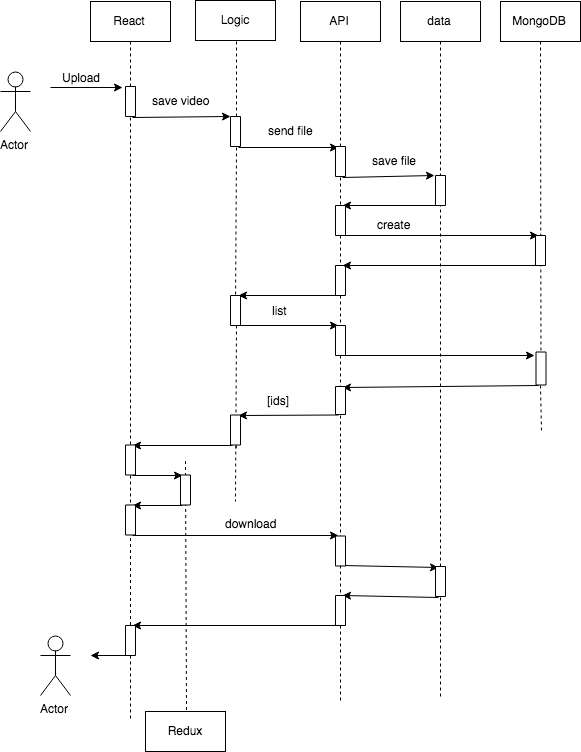
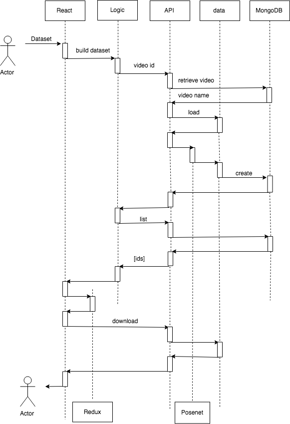
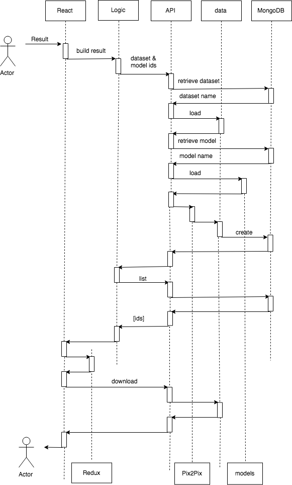
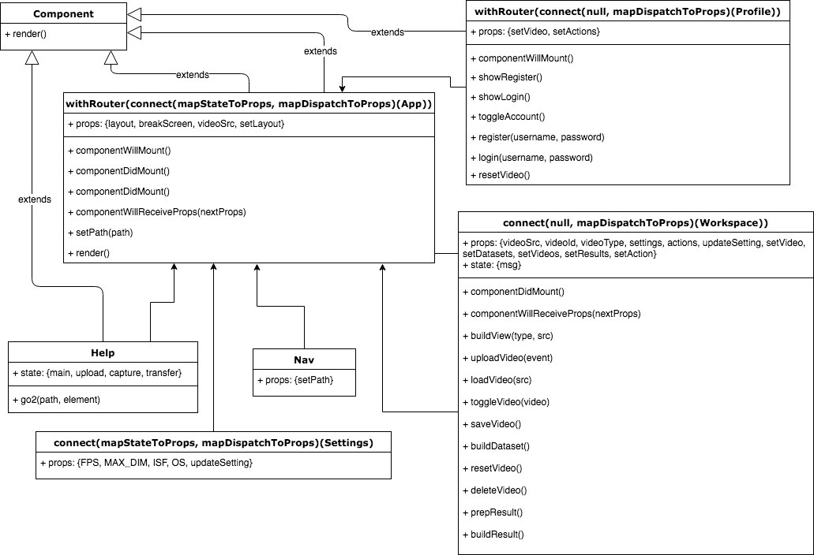
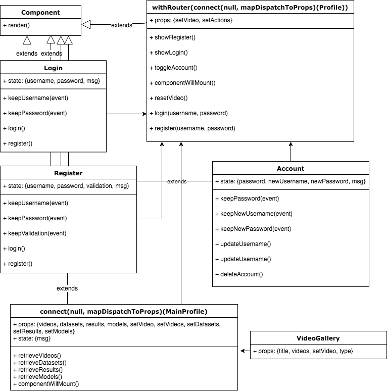

# Pose2Pose - APP

[Pose2Pose](http://pose2pose.surge.sh) is a web applications that lets you upload videos and extract the pose from it using the machine learning model [posenet](https://www.npmjs.com/package/@tensorflow-models/posenet). Then, you can use the pose from your video to sintetize new content with a pre-trained [pix2pix](https://github.com/affinelayer/pix2pix-tensorflow) machine learning model.

The result is a video featuring the new content but with the movement from you uploaded video. Possible applications of this webapp include easy and fast creation of character animations, visual effects for character creation and many more.

It was developed as a full-stack project for the Skylab Coders bootcamp (Barcelona, 2018). The objective was to apply the following technologies in a real life application:

 - Web: HTML, CSS, Javascript (ES6)
 - Styling: Sass, BEM
 - Front-end frameworks: React, React Router, Redux
 - Back-end frameworks: Node, Express
 - Database: MongoDB, Mongoose
 - TDD: Mocha, Chai

## Functional description 

### Use cases diagram 

As a user, you can upload a **video** and save it in your gallery. Then, you can extract the pose from the video to build a **dataset**. Finally, you can sintetize a **result** video with the movement from the dataset but with the content of one **model**. 

## Technical description

### Block diagram

The front end of the application was built using **React**, **React Router** and **Redux**. The back end is connected to the API in order to manage the users, store the videos and create the datasets and results using the different models.

### Sequence diagram

- Upload and save a video

- Create a dataset

- Create a result

### Class diagram

- Global

- Profile

